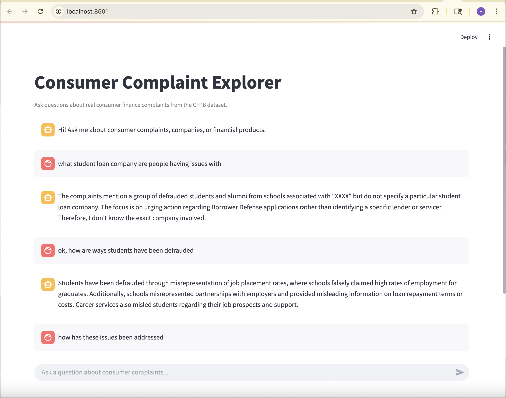

# AI-Powered Assistant for Financial Consumer Complaints

A Retrieval-Augmented Generation (RAG) based chatbot that allows users to interact with real-world financial consumer complaint data. This assistant uses LangChain, OpenAI, ChromaDB, and Streamlit to provide contextual responses based on retrieved complaints, supporting both CLI and web interfaces.


---

## Objective

Enable users to query the **Consumer Financial Protection Bureau (CFPB)** complaints dataset using natural language, delivering grounded, concise answers with source visibility. This project demonstrates a practical RAG pipeline applied to **financial literacy and regulatory transparency**.

This app improves financial literacy by letting users explore real-world complaint data through a conversational interface.

---

## Target Audience

- Financial consumers seeking complaint insights
- Financial literacy educators and nonprofits
- Regulatory and compliance professionals
- LLM developers and AI engineers learning RAG pipelines

----

## Features

- Retrieval-Augmented Generation (RAG) pipeline using LangChain
- ChromaDB vector store with OpenAI embeddings
- Contextual memory with `StreamlitChatMessageHistory` for UI and `RunnableWithMessageHistory` for CLI
- LangSmith integration for prompt tracing & observability
- CLI-based and Streamlit web UI interfaces

---

## Project Structure

```
chatbot/
├── chroma_db/                     # Vectorstore with persistent embeddings
├── data/
│   └── complaints.csv             # Complaint dataset (CSV)
├── logs/
│   └── ingestion.log              # Ingestion logs
├── notebooks/
│   ├── rag-llm.ipynb           # CLI testing and debug
│   └── exp-rag.ipynb              # Experimentation notebook
├── .env                           # Environment variables for keys, etc.
├── env.yml                        # Conda environment file
├── requirements.txt               # Python package dependencies
└── README.md                      # You're here!
├── src/
│   └── app.py                          # Streamlit UI chatbot
│   └── ingest.py                      # One-time or repeat ingestion script with logging
│   └── utils.py                        # Utility functions for data loading, vector store, etc.

```

---

## Setup Instructions

### 1. Clone & Navigate
```bash
git clone https://github.com/Fatimat01/consumer-complaint-chatbot.git
cd consumer-complaint-chatbot
```

### 2. Create Environment
```bash
conda env create -f env.yml
conda activate cc-chatbot
```
OR use pip:

```bash
python -m venv env
source env/bin/activate
pip install -r requirements.txt
```


### 3. Configure Environment Variables
Create a `.env` file in the root:
```env
OPENAI_API_KEY=your-openai-key
LANGCHAIN_API_KEY=your-langsmith-key

```

---

## Usage

### Download data
```bash
mkdir data
curl -o data/complaints.csv "https://www.consumerfinance.gov/data-research/consumer-complaints/search/api/v1/?date_received_max=2025-01-02&date_received_min=2025-01-01&field=all&format=csv&no_aggs=true&size=18423"
```

### CLI Chatbot
Run the notebook:
```bash
jupyter notebook notebooks/rag-llm.ipynb
```

### Ingest Data
```bash
python src/ingest.py
```

This creates `chroma_db/` with vectorized complaint chunks and logs ingestion metadata to `logs/ingestion.log`.

### Web UI
Launch Streamlit app:
```bash
streamlit run src/app.py
```

Example prompts:
- "Which mortgage company has the most issues?"
  - "What are consumers saying about OPTUM BANK, INC.?"
- "What issue are consumers most concerned about with Bank of America mortgage?"

---

## 📈 Observability & Monitoring

- [LangSmith](https://docs.smith.langchain.com/) logging and tracing enabled
- Vector retrieval preview & latency timing
- Session-level message history via `StreamlitChatMessageHistory`
- Log ingestion pipeline stats in `logs/ingestion.log`

---

## Dataset
- Source: [CFPB Consumer Complaints](https://www.consumerfinance.gov/data-research/consumer-complaints/)
- Format: CSV with 18,423 complaints between January, 01 2025 and January 02, 2025

---


## Acknowledgments

Built using:
- [LangChain](https://github.com/langchain-ai/langchain)
- [ChromaDB](https://www.trychroma.com/)
- [OpenAI LLMs](https://platform.openai.com/)
- [Streamlit](https://streamlit.io/)
- [LangSmith Observability](https://smith.langchain.com/)
- [Ready Tensor](https://app.readytensor.ai/)

---

## Next Steps

- **Continual Data Update**: Add more complaint data and re-index on ingestion
- **Persistent Memory**: Add Redis for long-term memory
- Add incremental ingestion support to `ingest.py`
- Enable user uploads or real-time data refresh
- **Production-Ready Deployment**: Deploy using Docker + EC2/EKS + HTTPS

------

## License

Licensed under the [MIT License](LICENSE).

---